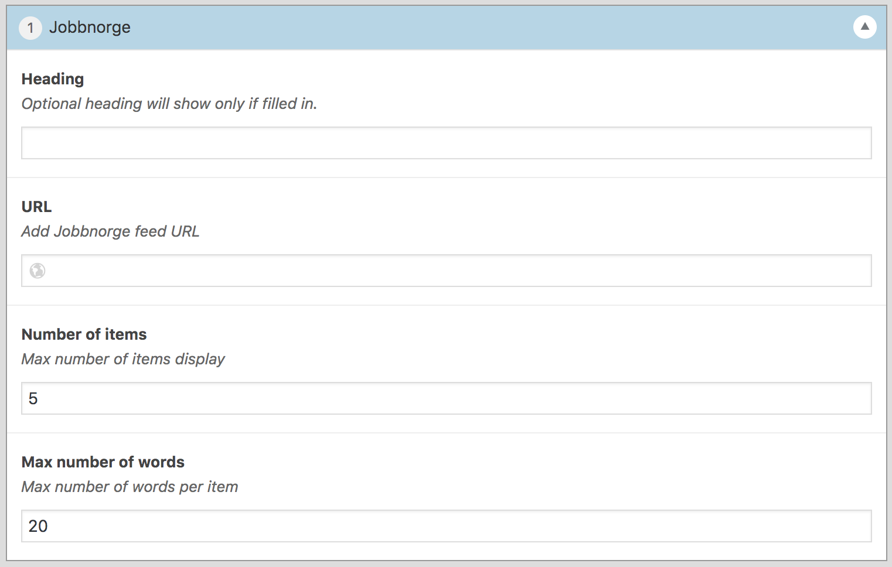

# Jobbnorge Module for [Hogan](https://github.com/dekodeinteraktiv/hogan-core)

## Installation
Downloading this repository and place it in `wp-content/plugins`

## Available filters
- `dss/hogan/module/jobbnorge/items` : Set default number of items.
- `dss/hogan/module/jobbnorge/words` : Set default number of words per item.

## The module



## HTML code generated

```html
<ul class="list-items card-type-large">
	<li class="list-item">
		<div class="column">
			<p>%1$s %2$s</p>
			<h3 class="entry-title"><a href="%3$s">%4$s</a></h3>
			<div class="entry-summary"><p>%5$s %6$s</p></div>
		</div>
	</li>
</ul>
```
1. Due date prefix
1. Due date
1. Permalink to job add
1. Job title
1. Job decription
1. 'Read more' link
